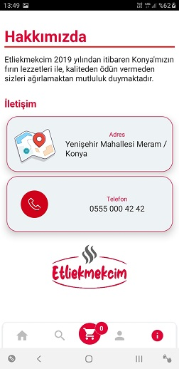

# Etliekmekcim Food Order App

## used in this project:

- React Navigation (Stack and Tab navigator),
- React Redux (Redux Toolkit),
- Firebase (Authentication, Cloud Firestore),
- Formik and Yup,
- Lottie animations,
- React Native Flash Message,
- Material Icon Package,
- Google Fonts,
- Creating Custom Component,

### HomePage

### Register and Login Page

### Cart Page

### About Page

### Order Page

